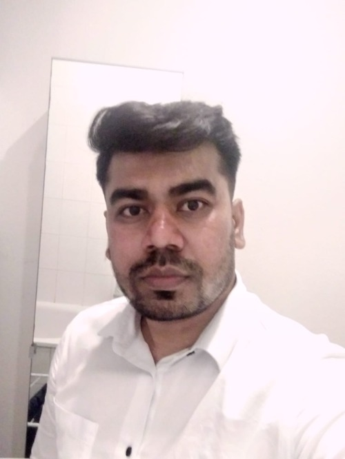
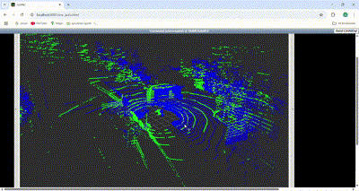
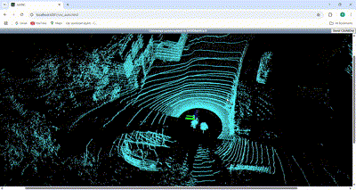

# Welcome to Mayur's Portfolio

<video width="640" height="360" controls>
    <source src="videos/4d_perception1.mp4" type="video/mp4">
    Your browser does not support the video tag.
  </video>

Hi, I'm **Mayur Rajendra Waghchoure** – an AI Engineer specializing in autonomous systems, machine learning, and robotics. I develop innovative solutions ranging from advanced ADAS features to deep learning projects for autonomous vehicles.

## About Me

With hands-on experience in both industry and research, I am an innovative AI/ML Engineer with 4+ years of experience in autonomous systems, deep learning, and 
data pipelines. Proven expertise in building end-to-end ML systems, from research to production
grade deployment. Skilled in MLOps, cloud technologies, and big data processing, with a passion for 
delivering scalable solutions for autonomous driving and robotics..

<video width="640" height="360" controls>
  <source src="videos/Final_output_video.mp4" type="video/mp4">
  Your browser does not support the video tag.
</video>
***Maneuver detected*** : Overtake Left - An ego car is overtaken by truck from left side as seen from above video.

**Master's Thesis output** - Learning-Based Maneuver Detection from multi-view camera data for extraction of critical scenarios from real world datasets (e.g., Nuscenes) for faster and robust verification and validation of Autonomous Driving Systems.

## Work Experience

- **Autonomous Driving Software Engineer**, Deontic.ai (Leuven,Belgium) | *Leuven, Belgium – Apr 2025 to Present*  
  I am involved in developing the state of art approach to revolutinize the autonomous driving testing using NLP and ASAM OpenX standard, and ODD based scenario generation strategies. I am involved in the task to integrate the sentence boundary detection, semantic chunk detection from the detected text from OCR read pdf files, generating the Model based system engineering compatible requirements and ODD attributes, and eventually generate the scenario suite using fine-tuned LLM models for the scenario generation and safety evaluations.

- **AI Content Creator**, Think Autonomous (Paris, France) | *Remote – Jan 2025 to Present*  
  ***Lidar-Lidar Registration***: Executed projects on lidar-camera calibration, multi-lidar registration (using GICP+ICP), and deep learning-based sensor fusion.    Designed tutorials on perception systems, SLAM, and 3D deep learning.
  
    **Multi-layered ICP registration:**  
    

    **Kiss ICP based SLAM:**  
    
  
  ***4D Perception***: Excuted the project on 4D perception, which involves object detection with OpenPcdet framework followed by 3D Association and Multi object tracking, and visualized it with rerun tool.
 

  
  

  <video width="640" height="360" controls>
    <source src="videos/4d_perception_rerun.mp4" type="video/mp4">
    Your browser does not support the video tag.
  </video>
  

  ***3D Reconstruction DLC***
    MVS, SFM, Nerf and Gaussian Splatting

  ***Advanced SLAM***

- **ADAS System Consultant**, Dorle Controls Pvt Ltd (Client – Battle Motors, USA) | *Aachen, Germany – Dec 2024 to Feb 2025*  
  Developed system requirements, SysML diagrams, and test plans for 7 ADAS features. Implemented features such as Automatic High Beam, Lane Departure Warning, and Highway Departure/Braking systems.

- **Master Thesis Student**, Siemens Digital Software Industries | *Leuven, Belgium – May 2024 to Nov 2024*  
  Developed a learning-based critical maneuver detection framework using the nuScenes dataset. Trained GNN and Transformer architectures and created trajectory/graph-based datasets to extract edge-case driving scenarios.

- **Research and Development Intern**, FEV.io GmbH | *Aachen, Germany – Sep 2023 to Jan 2024*  
  Designed C++ and ROS drivers for an open simulation interface between dSpace and ROS-based systems. Built an Android app for intelligent infotainment leveraging LLMs and the Whisper API.

- **Student Research Assistant**, Institute of Automotive Engineering (IKA), RWTH Aachen University | *Aachen, Germany – Dec 2022 to Mar 2023*  
  Developed Dockerized ROS environments for scalable automation and testing. Standardized environments for EdX courses and updated assignments for ROS1/ROS2 compatibility.

- **Autonomous Driving Software Engineer**, Dorle Controls Pvt Ltd | *Pune, India – Jun 2020 to Sep 2022*  
  Led a team of 6 engineers to develop and deploy Level-2 Autonomous Driving features including sensor fusion and motion prediction algorithms. Published research papers and conducted workshops for industry experts.

- **Support Service Engineer**, Tata Motors Ltd | *Pune, India – Feb 2018 to Sep 2018*  
  Conducted root cause analysis to resolve tire pressure issues and managed a team of 23 technicians in wheel and tire assembly processes.

## Education

- **Master of Science in Robotic Systems Engineering**  
  RWTH Aachen University, Aachen, Germany | *Oct 2022 – Present*  
  *Thesis:* Learning-Based Maneuver Detection from Ego-Perspective Camera Data for Autonomous Driving Systems

- **Bachelor of Engineering in Mechanical Engineering**  
  Savitribai Phule Pune University, Pune, India | *2012 – 2016*

## What You'll Find Here

- **Projects:** A detailed look at my work on object detection, 3D reconstruction, semantic segmentation, CI/CD pipelines, and more. [Explore Projects](project.md)
- **Research Publications:** A separate page showcasing my published research. [View Research Publications](research_publications.md)
- **Blog:** Insights and updates on AI, autonomous systems, and more. [Read My Blog](blogs/index.md)
- **Curriculum Vitae:** Download my CV for a comprehensive view of my professional journey. [View CV](cv.md)
- **Contact:** Get in touch through my dedicated contact page. [Contact Me](contact.md)

---

Feel free to browse around and reach out if you'd like to discuss any of my work or potential collaborations!
